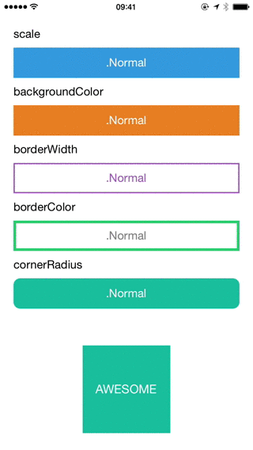

# SimpleButton


[](https://travis-ci.org/aloco/SimpleButton)


UIButton subclass with animated, state-aware attributes. Easy to subclass and configure! [Full API docs](http://aloco.github.io/SimpleButton/swift_output)


<center>

</center>


## Usage

Just create your own `SimpleButton` subclass and configure your button attributes by overriding `configureButtonStyles`.

```swift
class PrimaryButton: SimpleButton {
    override func configureButtonStyles() {
        super.configureButtonStyles()
		setBorderWidth(4.0, for: .normal)
        setBackgroundColor(UIColor(red: 52/255, green: 73/255, blue: 94/255, alpha: 1.0), for: .normal)
        setBackgroundColor(UIColor(red: 44/255, green: 62/255, blue: 80/255, alpha: 1.0), for: .highlighted)
        setBorderColor(UIColor(red: 44/255, green: 62/255, blue: 80/255, alpha: 1.0), for: .normal)
        setScale(0.98, for: .highlighted)
        setTitleColor(UIColor.whiteColor(), for: .normal)
    }
}
```
For usage in Interfacebuilder, just use your `SimpleButton` subclass as custom class for any `UIButton` element. All defined styles gets applied automatically.

You can also configure your button without a subclass directly inline.

```swift
let awesomeButton = SimpleButton(type: .custom)
awesomeButton.setBorderWidth(2.0, for: .normal)
awesomeButton.setBorderColor(UIColor.redColor(), for: .highlighted)
view.addSubview(awesomeButton)
```
Note that you should use `UIButtonType.custom` to avoid undesired effects.

Please checkout the example project for a detailed usage demo.


#### @IBDesignable

Have a look on [DesignableButton](Example/DesignableButton.swift) subclass within the Example Project for `@IBDesignable` usage.

### Animation
Each state change of `SimpleButton` animates by default. Sometimes you need to define which state transition should animate and which should happen immediately. Therefore you can control that behaviour with the `animated` and `animationDuration` parameters. 

```
setBorderWidth(4.0, for: .normal, animated: true, animationDuration: 0.2)
setBorderWidth(8.0, for: .highlighted, animated: false)

```
This means, every state change to `.normal` animates the `borderWidth` to `4.0`. 
Every state change to `.highlighted` changes instantly the `borderWidth` to `8.0` without animation.

### Loading state

`SimpleButton` has a custom `loading` state. You can toggle this state by setting `simpleButton.isLoading`. The button shows an `UIActivityIndicator` instead of the title when adding the `loading` state.

```
simpleButton.setCornerRadius(20, for: SimpleButtonControlState.loading)
simpleButton.isLoading = true

```
If you don´t like the default loading indicator, you can set your own `UIView` by doing
```
simpleButton.loadingView = CustomAwesomeLoadingView()
```


## Configurable attributes

Take a look at the ```Setter for state attributes``` section of the [API Docs](http://aloco.github.io/SimpleButton/swift_output/Classes/SimpleButton.html#/Setter%20for%20state%20attributes) 

## Installation

Note that SimpleButton is written in `swift 3` and may not be compatible with previous versions of swift. 


#### Carthage

Add the following line to your [Cartfile](https://github.com/Carthage/Carthage/blob/master/Documentation/Artifacts.md#cartfile).

```
github "aloco/SimpleButton" ~> 3.0
```

Then run `carthage update`.

#### Manually

Just drag and drop the `SimpleButton.swift` file into  your project.


## Contributing

* Create something awesome, make the code better, add some functionality,
  whatever (this is the hardest part).
* [Fork it](http://help.github.com/forking/)
* Create new branch to make your changes
* Commit all your changes to your branch
* Submit a [pull request](http://help.github.com/pull-requests/)
