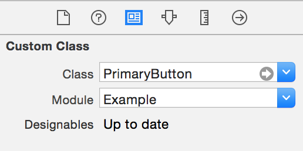

# Simple Button


Simple UIButton subclass with animated, state-aware attributes. Easy to subclass and configure!

<center>

</center>

## Usage

Just create your own `UIButton` subclass and configure your button attributes by overriding `configureButtonStyles`. 

```swift
@IBDesignable
class PrimaryButton: SimpleButton {
    override func configureButtonStyles() {
        configureButtonStyles()
		setBorderWidth(4.0, forState: .Normal)
        setBackgroundColor(UIColor(red: 52/255, green: 73/255, blue: 94/255, alpha: 1.0), forState: .Normal)
        setBackgroundColor(UIColor(red: 44/255, green: 62/255, blue: 80/255, alpha: 1.0), forState: .Highlighted)
        setBorderColor(UIColor(red: 44/255, green: 62/255, blue: 80/255, alpha: 1.0), forState: .Normal)
        setScale(0.98, forState: .Highlighted)
        setTitleColor(UIColor.whiteColor(), forState: .Normal)
    }
}
```

### Interface Builder Support

Just set the new custom button class to a button in Interface Builder's property inspector.

<center>

</center>

Your buttons are even rendered live within Interface Builder. ✨
Some attributes, like corner radius, border width and border color, can be set directly from within Interface Builder.


### Creating and configuring buttons from code

You can also configure your button directly from code

```swift
let awesomeButton = SimpleButton.buttonWithType(.Custom)
awesomeButton.setBorderWidth(2.0, forState: .Normal)
awesomeButton.setBorderColor(UIColor.redColor(), forState: .Highlighted)
```

## Configurable attributes

* `scale`
* `backgroundColor`
* `borderWidth`
* `borderColor`
* `cornerRadius`


### scale

```swift
simpleButton.setScale(0.98, forState: .Highlighted)
simpleButton.setScale(0.80, forState: .Disabled)
```

### backgroundColor

```swift
simpleButton.setBackgroundColor(UIColor(red: 52/255, green: 73/255, blue: 94/255, alpha: 1.0), forState: .Normal)
simpleButton.setBackgroundColor(UIColor(red: 44/255, green: 62/255, blue: 80/255, alpha: 1.0), forState: .Highlighted)
simpleButton.setBackgroundColor(UIColor.grayColor(), forState: .Disabled)
```

### borderWidth

```swift
simpleButton.setBorderWidth(4.0, forState: .Normal)
simpleButton.setBorderWidth(2.0, forState: .Highlighted)
```

### borderColor

```swift
simpleButton.setBorderWidth(4.0, forState: .Normal)
simpleButton.setBorderColor(UIColor(red: 230/255, green: 126/255, blue: 34/255, alpha: 1.0), forState: .Normal)
simpleButton.setBorderColor(UIColor(red: 149/255, green: 165/255, blue: 166/255, alpha: 1.0), forState: .Highlighted)
```

### cornerRadius
```swift
simpleButton.setCornerRadius(10, forState: .Normal)
simpleButton.setCornerRadius(20, forState: .Highlighted)
```

## Installation

Note that SimpleButton is written in `swift 1.2` and may not be compatible with previous versions of swift.

#### Carthage

Add the following line to your [Cartfile](https://github.com/Carthage/Carthage/blob/master/Documentation/Artifacts.md#cartfile).

```
github "aloco/SimpleButton"
```

Then run `carthage update`.

#### Manually

Just drag and drop the `SimpleButton.swift` file into  your project.


## Contributing

* Create something awesome, make the code better, add some functionality,
  whatever (this is the hardest part).
* [Fork it](http://help.github.com/forking/)
* Create new branch to make your changes
* Commit all your changes to your branch
* Submit a [pull request](http://help.github.com/pull-requests/)
